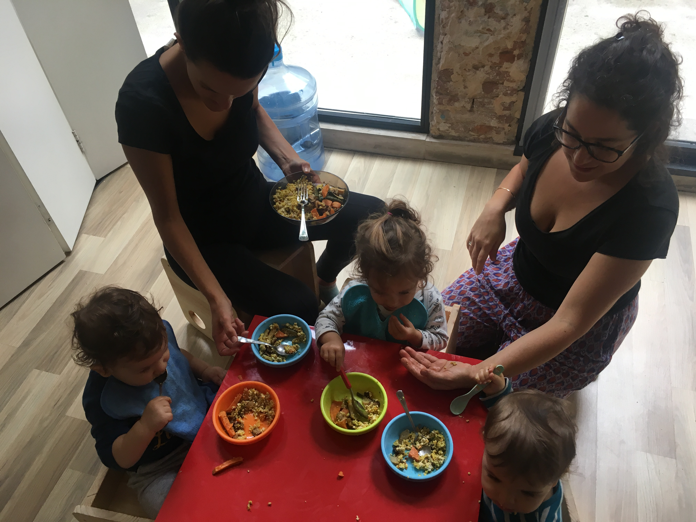
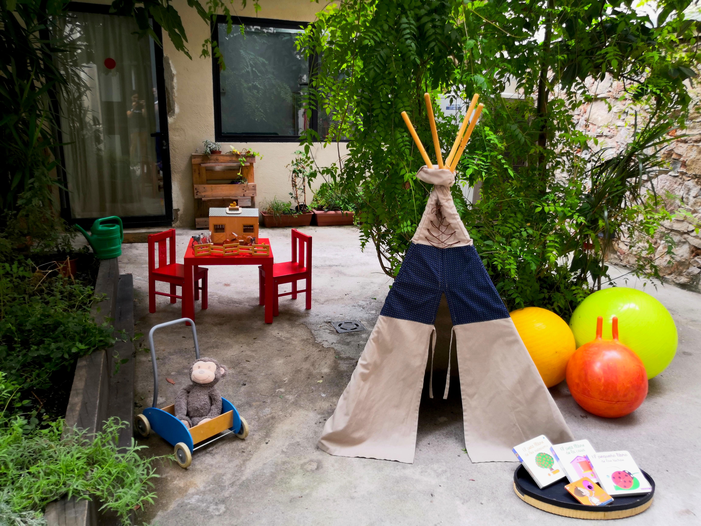
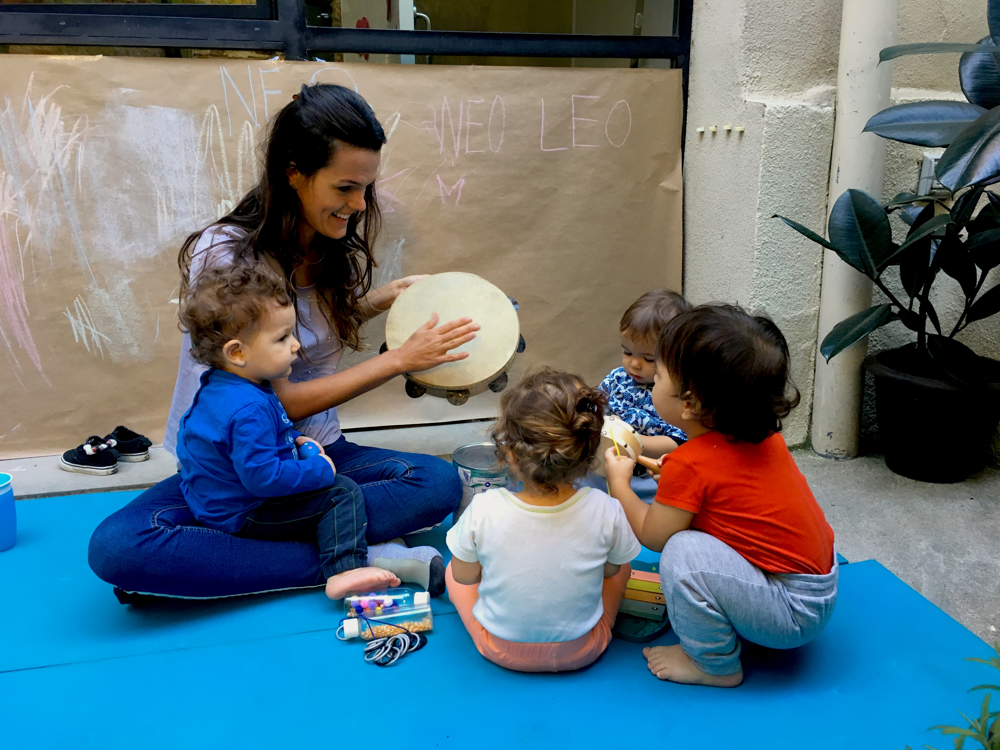

## Crianza segura

Durante las  edades más tempranas de nuestros hijos/as, es importante acompañarlos en la difícil tarea de la separación. Es necesario realizar una adaptación progresiva que dé tiempo al niño/a a crear el vínculo emocional  con la educadora y con el resto de las familias de las que se compone el grupo. Por esta razón,  este tipo de crianza segura y respetuosa permite que nuestros hijos/as se adapten de forma natural al nuevo entorno, a la separación física y que aprendan a dar validez y a escuchar sus emociones.

Los padres y madres debemos acompañarlos durante el tiempo que necesitemos hasta que el pequeño sienta este nuevo espacio como propio.

Para nosotros no solo es vital el vínculo que se forma entre las educadoras y los niños, también lo es el vínculo que surge entre las familias y el apego entrañable que nace con los hijos de nuestros compañeros.

## Petit Titans

Nuestro proyecto de crianza nace del deseo de un grupo de familias de involucrarse en el proceso evolutivo de sus pequeños desde una mirada amorosa y respetuosa, escuchando de forma atenta sus necesidades y acompañando sus ritmos naturales.

Al mismo tiempo necesitamos una alternativa que nos permita formar una tribu, construir una gran familia, aprender la una de la otra, compartir las luces y las sombras de la ma/paternidad, sentirnos acompañados y divertirnos en familia.

En definitiva, tener un espacio flexible de escucha en el cuál se tengan en cuenta las necesidades y realidades de cada unidad familiar para no hacer este camino en solitario.

Creemos que la mejor manera que tiene un niño de desarrollarse es pasando tiempo con sus padres, con sus abuelos, con amigos, con otros niños y, en general, con gente responsable que se haga cargo en diversos momentos de ese niño y de todos los niños.

Para criar hace falta una tribu entera, pero a menudo no disponemos de ella, bien sea porque están lejos o porque se alejan mucho de nuestras creencias y formas de crianza. Esta iniciativa surge de la voluntad de criar en manada, teniendo en común una manera de ser o vivir, compartiendo otras formas de ver, pensar y de actuar. Sin juzgar ni confrontar, encontrando siempre la manera de acompañarnos, apoyarnos, escucharnos y crecer todos juntos.

## Respeto

Para nosotros criar de manera respetuosa no tendría sentido si ese respeto no se hiciera extensivo a todos los ámbitos que nos rodean. Por ello, respetamos las necesidades de cada familia y escuchamos sus inquietudes. Respetamos a las educadoras ofreciéndoles unas condiciones laborales justas que les permita involucrarse de forma activa en el proyecto y dignificando la gran labor que supone la crianza de nuestros hijos/as.

Por último, respetamos el medio ambiente. Reciclamos y reutilizamos. Utilizamos productos naturales , de temporada, ecológicos y de proximidad,  tanto en la limpieza del espacio , como en la alimentación de nuestros pequeños/as.

## Entorno

Petits Titans comparte espacio con Titània- Tascó, en la calle Llibertat de Vil·la de la Gràcia. Una cooperativa de matronas que acompañan a las parejas en sus experiencias del embarazo, parto, y post parto. Titania-Tascó nos ha abierto sus puertas y nos ha cedido sus espacios durante las mañanas para dar forma y fuerza a este proyecto de crianza que con tanta ilusión sacamos adelante. Vemos Petits Titans como una continuación lógica del acompañamiento respetuoso, calmado y personalizado que ofrece Titania-Tascó.

Petits Titans es un espacio vivo, amoroso y alegre abierto a pequeños de 1 a 3 años. Es un lugar que nos brinda la posibilidad de ser libres, sentir, expresar emociones,

deseos e inquietudes por medio del otro, elementos que nos parecen esenciales en estas primeras etapas de la vida.

## Funcionamiento

Es un proyecto autogestionado por y para las familias. Para que esta estructura sea posible requiere de una implicación del padre y/o madre, que acompañe a los niños y al proyecto en la medida que pueda involucrarse según su logística. Esto significa:

* Participar en las asambleas mensuales para definir nuestras necesidades y tomar decisiones todos juntos.
* Asistir (las familias que tengan disponibilidad) presencialmente como apoyo a las educadoras una mañana por semana (o una parte de la mañana).
* Alternativamente se puede formar parte de una comisión para llevar a cabo una tarea de gestión y otros roles relacionados con el proyecto.

Formar parte de un proyecto de estas características no solo nos permite un rol activo en el acompañamiento de nuestros hijos, sino que también nos da la oportunidad de crear un espacio a nuestra medida que se adapte a las necesidades particulares de cada familia y a nuestras creencias.

Además, participar de un proyecto autogestionado supone, sin duda, un crecimiento a nivel personal, en el cual vamos aprendiendo y reinventándonos cada día los unos de los otros, tanto los grandes como los pequeños.

## Cómo nos organizamos?

* Horario : De Lunes a Viernes de 9-15h (Inicio Septiembre 2.019)
* Ratio acompañantes : 10-12 niños, 2 educadoras y el apoyo de 1 padre /madre
* Turnos de familias : 1 día / semana como apoyo a las 2 educadoras (las familias que tengan disponibilidad).
* Comidas : Las familias nos turnamos para elaborar cada día el almuerzo. Partimos de la base de un menú equilibrado y sano. 
* Asambleas : Para el buen funcionamiento del proyecto nos reunimos en una asamblea mensual de obligada asistencia, donde se tratarán temas tanto del día a día del proyecto como pedagógicos y emocionales.
* Comisiones : Al ser un proyecto auto-gestionado por las familias es importante distribuir los trabajos equitativamente entre las familias. Por eso nos organizamos en comisiones de trabajo en las que cada familia participa según su disponibilidad que puede ir cambiando con el tiempo.
  * Calendario (de padres / madres y menú)
  * Comunicación (con Titania, con el exterior)
  * Pedagogía (comunicación con las educadoras)
  * Economía (cobrar cuotas, hacer transferencias, gestión inversiones material, salidas, comida, etc.)
  * Comando bricolaje (mantenimiento del espacio y material)
  * Administración (seguros, gestor, comunicación con las familias, ...)

Ahora que el proyecto a encontrado la luz nos gustaría abrirlo a otras familias que compartan estas inquietudes y esta mirada respetuosa en la educación. Si te interesa el proyecto, te gustaría que tu niño forme parte de los Pequeños Titanes y es nacido en 2018 o 2019 nuestras puertas están abiertas, nos encantaría conocerte , resolver tus dudas y pasar un rato juntos. 

Escríbenos al correo petitstitans@gmail.com
O contacta a Elisenda en el 664023692
