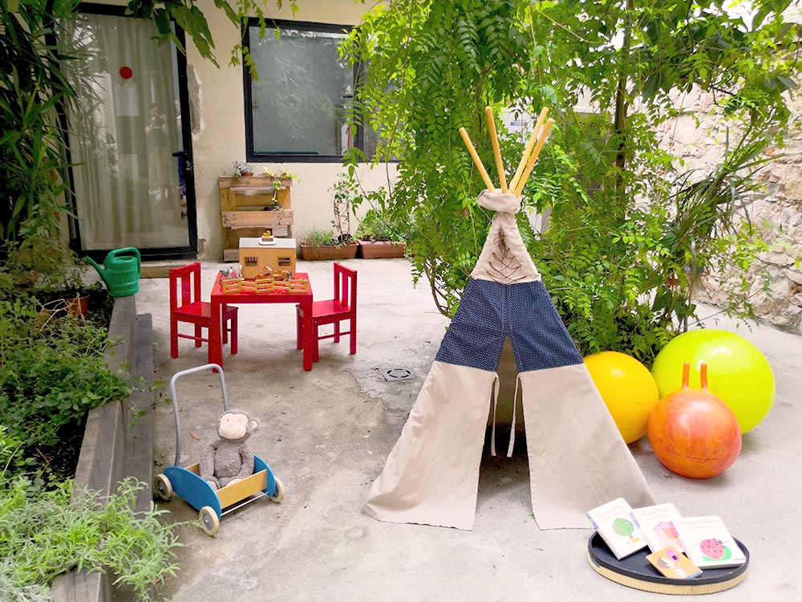

## Criança segura

Quan els nostres fills/es son petits és important acompanyar-los en el difícil procés de la separació. Cal realitzar una adaptació progressiva que els doni el temps necessari de crear un víncle emocional amb la educadora i amb la resta de famílies que formen part del grup. La criança segura i respetuosa permet que els nostres fills i filles s’adaptin de manera natural al nou entorn, a la separació física i que aprenguin a donar validesa i a escoltar les seves emocions.

Els pares i mares els hem d’acompanyar el temps que calgui fins que la criatura senti el nou espai com a propi. Per a nosaltres és vital el víncle que s’estableix entre la educadora i els nens/es, però també ho és el vincle que sorgeix entre les famílies i l’estima que neix envers els fills dels nostres companys. 

## Petit Titans

El nostre projecte de criança neix del desig d’un grup de famílies d’involucrar-se en el procés evolutiu dels seus petis amb una mirada amorosa y respetuosa, escoltant atentament les seves necessitats y acompanyant el ritme natural de cada infant.

A la vegada, necessitem una alternativa que ens permeti formar una tribu, construir una gran família, aprendre la una de l’altra, compartir les llums i les ombres de la ma/paternitat, sentir-nos acompanyats y divertir-nos en família.

En definitiva, busquem un entorn flexible on es tinguin en compte les necessitats i les realitats canviants de cada unitat familiar per tal de no fer aquest camí en solitari. 

Creiem que la millor manera que té una criatura de desenvolupar-se és passant temps amb els seus pares, avis, amics i amb altres nens y, en general, amb gent responsable que en tingui cura en diversos moments. Per criar fa falta una tribu sencera, però sovint no en disposem d’una, ja sigui perquè la tenim lluny o perquè s’allunyen molt de les nostres creences respecte a la criança. Aquesta iniciativa neix de la voluntat de criar en manada, de compartir una manera de ser i de fer i d’aprendre dels altres, sense jutjar-nos ni amb confrontacions per tal de poder-nos acompanyar, donar suport i créixer junts. 

## Respecte

Per a nosaltres criar amb respecte no tindria sentit si aquest respecte no es fes extensiu a tots els àmbits que ens envolten. Així doncs, respectem les necessitats de cada família i escoltem les seves inquietuds. Respectem les educadores oferint-los unes condicions laborals justes que els permeti involucrar-se activament al projecte amb l’objectiu de dignificar la gran tasca que duen a terme, contribuint a la criança dels nostres fills i filles. 

Per acabar, respectem el medi ambient. Reciclem i reutilitzem. Fem servir productes naturals en la neteja de l’espai i alimentem als petis i petites amb aliments de proximitat, de temporada i ecològics.

## Pedagogia

Llegeix el [pdf creat per la nostra educadora Karine](assets/textos%20Karine.pdf)

## Entorn

Petits Titans comparteix espai al carrer Llibertat de Vil·la de la Gràcia  amb Titània- Tascó, que és una cooperativa de matrones que acompanyen a les parelles durant l'embaràs, part i post-part, amb qui compartim la filosofia de l’acompanyament respectuós, calmat i personalitzat. 

Petits Titans és un espai viu, amorós i alegre obert a infants d’ 1 a 3 anys. És un lloc que ens dona l’oportunitat de ser lliures, sentir, expressar emocions, desitjos i inquietuds mitjançant el joc lliure, l’exploració de l’entorn i l’autodescobriment a través dels altres. Aquests conceptes ens semblen essencials en les primeres etapes de la vida.

## Funcionament

Es un projecte autogestionat per les famílies. Per tal que aquesta estructura sigui possible, és necessària la implicació del pare i/o mare que acompanyi els infants i el projecte en la mesura que pugui implicar-s’hi segons la seva logística. Això vol dir:

* Participar en les assemblees mensuals per definir les nostres necessitats i prendre decisions junts.
* Asistir (les famílies que disposin de disponibilitat) presencialment com a suport a les educadores un matí (o una part del matí) cada 15 dies .
* Alternativament es pot formar part d’una comissió que dugui a terme una tasca de gestió i altres rols relacionats amb el projecte. 

Formar part d’un projecte d’aquestes característiques no només ens permet un paper actiu en l’acompanyament dels nostres fills i filles, sinó que també ens ofereix l’oportunitat de crear un espai que encaixi amb les necessitats particulars de cada família i que s’adapti a les nostres creences. 

A més a més, participar en un projecte autogestionat aporta un creixement a nivell personal durant el que no parem d’aprendre sobre nosaltres mateixos i dels companys de viatge. 

## Com ens organitzem?

Com ens organitzem?
* Horari: De dilluns a divendres de 9-15h (Inici: septembre de 2019)
* Ratio d’acompanyants: 10-12 nens, 2 educadores i un pa/mare de suport
* Torns de famílies: 1 dia cada 15 dies com a suport a les educadores (les families que tinguin disponibilitat).
* Menjars: Les famílies fem torns per elaborar el dinar cada 15 dies. Partim de la base d’un menú equilibrat i sa.
* Assemblees: Pel bon funcionament del projecte ens reunim en una assemblea mensual d’obligada assistència, on es tracten temes del día a día, però també pedagògics i emocionals.
* Comissions : Com que som un projecte autogestionat és important distribuir les feines equitativament entre les famílies. Per això ens organitzem en comissions en les quals cada família participa segons la seva disponibilitat que pot anar canviant durant el temps:
  * Calendari (dels torns del menú, de suport...)
  * Comunicació (amb Titània, amb l’exterior)
  * Pedagogía (comunicació amb les educadores)
  * Economía (gestionar els comptes, les inversions en material, sortides, etc.)
  * Comando bricolatge (manteniment de l’espai i del material)
  * Administració (comunicació amb les famílies i el gestor)

**Ara que el projecte ja roda ens agradaria obrirlo a altres famílies que comparteixin aquestes inquietuts i mirada respectuosa envers l’educació. Si t’interessa el projecte, t’agradaria que el teu fill/a formi part de Petits Titans i ha nascut entre 2018 o 2019 les nostres portes estan obertes, ens encantaria conèixer-te, resoldre dubtes i passar una estona junts.** 

### Escriu-nos al correu petitstitans@gmail.com
### O contacta amb l’Elisenda al 664023692
